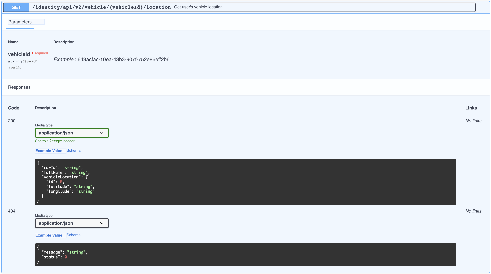

# Test Fixtures for API Parameters

## What are test fixtures?

[Software test fixtures][fixtures] initialize test functions. They provide a fixed baseline so that tests execute reliably and produce consistent, repeatable, results.

[JUnit Fixtures][junit], and [PyTest Fixtures][pytest] are pretty commonly used by modern development teams.

Initialization may setup services, state, or provide seed values to (mandatory & optional) API input parameters, so that the API invocation succeeds.

For example, effective testing of the API endpoint `GET /ride_receipts/{receipt_id}`, might require a 
known and valid value for the `{receipt_id}` parameter, which is present in the receipts database.

Without this known seed value, the test that exercises this API endpoint might not get a proper response from the API endpoint. Fixtures allow providing this seed value for the `{receipt_id}` parameter.

## Levo's Test Fixtures
Levo provides fixtures for configuring seed values for various API endpoint parameters. These fixtures are available at the `Test Case` level, `Test Suite` level, and `Test Plan` level as shown below.

Fixtures at the `Test Suite` level will automatically apply to all `Test Cases` within that `Test Suite`. Fixtures ate the `Test Plan` level will apply to all `Test Suites`.


## Test Fixture Format



Above is an example of an API endpoint that has `{vehicleId}` as a path parameter. This endpoint checks if the vehicle specified by the `{vehicleId}` is present in it's database.

If the specified vehicle is present, it returns `200 OK` and the vehicle details. If not present it returns `404 Not Found` and an appropriate error message.

In order to effectively test this endpoint for various security vulnerabilities, we need to know the ID of at least one legitimate vehicle present in the API server's database. Using random values for `{vehicleId}` will not exercise all code paths within the endpoint's implementation, largely resulting in 404 responses.

Below is an example of a test fixture that allows specifying a legitimate `{vehicleId}` value to be used when testing the endpoint.

```python
@levo.fixture(name="vehicleId", location="path")
def vehicleid():
    return "649acfac-10ea-43b3-907f-752e86eff2b6"
```

While the example above returns a hardcoded value, the fixture could be coded to perform a database lookup, or make an API call to get the appropriate value.


[fixtures]: https://en.wikipedia.org/wiki/Test_fixture#Software
[junit]: https://github.com/junit-team/junit4/wiki/Test-fixtures
[pytest]: https://docs.pytest.org/en/6.2.x/fixture.html