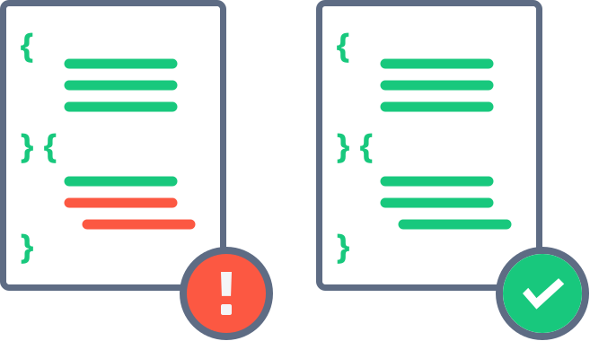

# API Schema / Contract Non-Conformance

## What is it?
API endpoints have a defined schema (aka contract), that is often described in [**OpenAPI Specification**][1] format. The contract allows clients of the API endpoint to interact with it, without knowledge of the underlying implementation. Schema / Contract conformance testing ensures that said contract matches the actual implementation of the API endpoint. [Contract testing][contract-driven-testing] is a critical tool to detect breaking changes before they are deployed to production!

## References
[API Contract Testing](https://docs.pact.io/)  
[API Schema Validation](https://github.com/schemathesis/schemathesis/blob/master/README.rst)  
[Contract Driven Testing][contract-driven-testing]

## How does it work?
The API endpoints are exercised by sending specially crafted (fuzzed) payloads that violate the defined schema on purpose. If the API implementation is robust, the API will reject the request or gracefully fail.

For example, when dealing with string fields, if the defined maximum string length is 50 chars, the crafted payload could have a string length that exceeds 50 chars. If an integer field specifies positive ranges, the crafted payload could have negative values to test for proper input validation.

These tests will work on both authenticated and unauthenticated API endpoints.

## Test case FAQs
### What are the type of schema conformance tests?
##### Status Code Conformance Test
    This test checks to see if the API implementation returns any undocumented response status codes.
##### Response Headers Schema Conformance Test
    This test checks to see if the API implementation returns all the `required` response headers documented in the schema.
##### Content Type Schema Conformance Test
    This test checks to see if the API implementation returns the appropriate `content types` documented in the schema.
##### Response Schema Conformance Test
    This test checks to see if the response body returned by API implementation conforms to the JSON structure documented in the schema.
##### Unexpected Server Error Schema Conformance Test
    This test checks to see if `500 Server Error` response codes are returned by the API implementation. `500` errors are unexpected errors.

## What is the solution?
* Document all expected response codes in the API schema.
* Only document all the `required` headers in the response section of the schema.
* Document all expected `content-type` that is returned in the response section of the schema.
* Document (in the schema) all expected JSON structures that are returned by the API implementation in the response body.
* In case of `Unexpected Server Error`, the test case summary will indicate the specified `input parameter` value/ranges that caused the error. Use this hint to fix the implementation such that it either rejects the request or fails gracefully.

[1]: https://swagger.io/specification/
[contract-driven-testing]: https://www.ibm.com/garage/method/practices/code/contract-driven-testing/