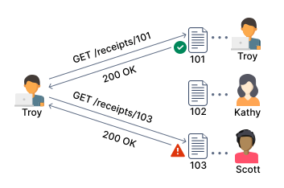

# OWASP API A1 - Broken Object Level Authorization

## What is it?
Attackers substitute the ID of their own resource in the API call with an ID of a resource belonging to another user. The lack of proper authorization checks allows attackers to access the specified resource. This attack is also known as IDOR (Insecure Direct Object Reference).

In the above example Troy (who is an authenticated user) is able to access Scott's receipt! This is a serious vulnerability, that is a result of improper authorization checks at the `GET /receipts/{receipt_id}` API endpoint.

## References
[OWASP API TOP-10 #1](https://owasp.org/www-project-api-security/)  
[BOLA / IDOR in API Security Encyclopedia](https://apisecurity.io/encyclopedia/content/owasp/api1-broken-object-level-authorization)

## Test case FAQs
### When is this test case applicable?
* Only for API endpoints that require authentication
* API endpoints that take one or more object/resource ids as an input via query or path params
* Currently only for non state changing operations like `GET`. Coverage for state changing operations (POST, PUT, DELETE, etc.) will follow soon. 

## How does it work?
1. Expects authentication details of two different users, `victim` and `attacker`, to be configured via fixtures.
2. Expects all other endpoint params (query or path params) to be configured via fixtures.
3. Sends a request using victim's credentials, and stores the response.
4. Sends the exact request from the previous step, but with the `attacker's` credentials. 
5. The two responses from the above two requests are compared
6. If the **comparison is a match**, this is raised as an IDOR/BOLA vulnerability

## What is the solution?
* Implement granular authorization checks, that tests for proper ownership of the requested resource(s) by the user making the request.
* Authorize every request made by the user.
* Do not rely on resource IDs that the client sends. Use IDs stored in the session object instead.
* Use random resource IDs that cannot be guessed ([UUIDs](https://en.wikipedia.org/wiki/Universally_unique_identifier)).

## False positives
The test case will generate a false positive, if the endpoint requires authentication and is designed to serve same object/resource for two different users. 

This could happen with with endpoints that server blog posts etc. In such cases you can disable the test case from executing, in the test plan.
