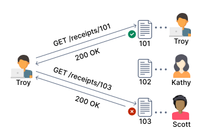

# Broken Object Level Authorization (aka IDOR)

## What is it?
Attackers substitute the ID of their own resource in the API call with an ID of a resource belonging to another user. The lack of proper authorization checks allows attackers to access the specified resource. This attack is also known as IDOR (Insecure Direct Object Reference).

In the above example Troy (who is an authenticated user) is able to access Scott's receipt! This is a serious vulnerablity, that is a result of improper authorization checks at the `GET /receipts/{receipt_id}` API endpoint.

## References
[OWASP API TOP-10 #1](https://owasp.org/www-project-api-security/)  
[BOLA / IDOR in API Security Encyclopedia](https://apisecurity.io/encyclopedia/content/owasp/api1-broken-object-level-authorization)

## Test case FAQs
### For what endpoints does this test case work?
* Only API endpoints that require authentication
* API endpoints that take one or more object/resource ids as an input via query or path params

## How does it work?
1. Expects authentication details of two different users, `victim` and `attacker`, to be configured via fixtures.
2. Expects all other endpoint params (query or path params) to be configured via fixtures.
3. If the endpoint needs a body (PUT or POST), the test case generates a sample body.
4. Sends a request using victim's credentials, and stores the response.
5. Sends the exact request from the previous step, but with the `attacker's` credentials. 
6. The two responses from the above two requests are compared
7. If the **comparison is a match**, this is raised as an IDOR/BOLA vulnerability

## False positives
The test case will generate a false positive, if the endpoint is authenticated and is designed to serve same object/resource for two users. This could happen with with endpoints that server blog posts etc. In such cases you can disable the test case from executing, in the test plan.

## What is the solution?
* Implement authorization checks with user policies and hierarchy.
* Do not rely on IDs that the client sends. Use IDs stored in the session object instead.
* Check authorization for each client request to access database.
* Use random IDs that cannot be guessed ([UUIDs](https://en.wikipedia.org/wiki/Universally_unique_identifier)).