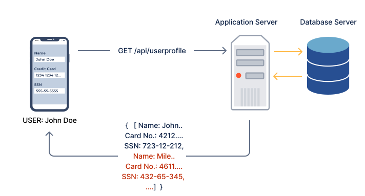

# API A3 - Excessive Data Exposure

## What is it?
An API is only supposed to return the required data to the front-end clients. Sometimes developers will make a mistake or implement HTTP parameter auto-binding that results in all data being returned to the client. 

This results in excessive data exposure that can be easily mined and exploited by attackers.

## What are specific examples?
    
- Scenario 1

    A mobile team uses the /api/articles/{articleId}/comments/{commentId} endpoint in the articles view to render comments metadata.

    Sniffing the mobile application traffic, an attacker finds out that other sensitive data related to comment’s author is also returned.
    
    The endpoint implementation uses a generic toJSON() method on the User model, which contains PII, to serialize the object.

- Scenario 2
    
    An IOT-based surveillance system allows administrators to create users with different permissions.
    
    An admin created a user account for a new security guard that should only have access to specific buildings on the site. 
    
    Once the security guard uses his mobile app, an API call is triggered to: /api/sites/111/cameras in order to receive data about the available cameras and show them on the dashboard.
    
    The response contains a list with details about cameras in the following format: {"id":"xxx","live_access_token":"xxxx-bbbbb","building_id":"yyy"}. 
    
    While the client GUI shows only cameras which the security guard should have access to, the actual API response contains a full list of all the cameras in the site.

## References
[OWASP API TOP-10 A3](https://owasp.org/www-project-api-security/)  
[Secure Coding Handbook](https://vladtoie.gitbook.io/secure-coding/api/excessive-data-exposure)

## Test case FAQs

### When is this test case applicable?
* Applicable to all API endpoints that return JSON data.

### How does it work?
- The response returned from the endpoint is screened for classified/sensitive data using trained machine learning model.
- The density of sensitive data (PII/PSI) present in the response is computed, and the response is assigned an appropriate risk level.

### What is the solution?
- Never rely on the client-side to filter sensitive data; this should be done at the API level.
- Cherry-pick the specific properties of the response you want to return. Avoid using generic methods such as to_json() and to_string().
- Classify sensitive and personally identifiable information (PII) that your application works with. Review all API endpoints that return such information to see if these responses pose a security issue.
- Implement a schema-based response validation mechanism as an extra layer of security. As part of this mechanism define and enforce data returned by all API methods, including errors.

