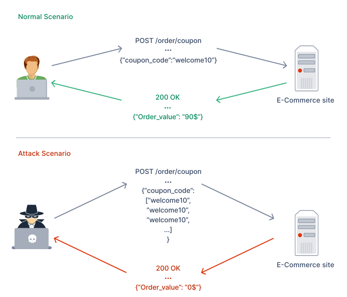

# API A6 - Mass Assignment

## What is it?
Modern software frameworks allow developers to automatically bind API request parameters into application code's variables or objects to reduce development effort.

Attackers can sometimes use this methodology to add new parameters that the developer never intended.

This can cause the unintended creation of new variables/objects and/or the modification of existing variables/objects in the application code.

The outcome of the above actions could be unintended privilege escalation or abuse of the underlying business logic of the API, which profits the attacker. 

This is called a `Mass Assignment` vulnerability.

### Alternative Names
Depending on the language/framework in question, this vulnerability can have several alternative names:

- Mass Assignment: Ruby on Rails, NodeJS.
- Autobinding: Spring MVC, ASP NET MVC.
- Object injection: PHP.

## What are specific examples?
In the diagram above, the attacker sends the same discount code multiple times as a JSON array, leading to a 100% discount, and paying $0 for his purchases.

This was clearly not the intent of the API developer. 

## References
[OWASP API TOP-10 A6](https://owasp.org/www-project-api-security/)  
[Mass Assignment - Cheat Sheet](https://cheatsheetseries.owasp.org/cheatsheets/Mass_Assignment_Cheat_Sheet.html)

## Test case FAQs

### When is this test case applicable?
* Applicable to all API endpoints that accept query and/or body parameters.

### How does it work?
- For query and body parameters expected in the API endpoint's request, additional (extraneous) parameters are added iteratively, before making the request.
- Primitive, array, and dictionary JSON elements are subject to this treatment.
- If the API endpoint is robust, it should reject these malicious requests outright.
- Vulnerable API endpoints will serve a normal successful response, or a variant of the normal successful response, or fail in unexpected ways (exceptions, etc.)

### What is the solution?
- Do not automatically bind all incoming parameter data to internal variables/objects.
- Based on the business context of the API endpoint, explicitly define what incoming parameters should be automatically bound.
- If certain internal variables/objects of the API endpoint are readonly, annotate them as readonly in the framework's auto bind.
- Precisely define the schemas, types, and patterns you will accept in requests at design time and enforce them at runtime.

