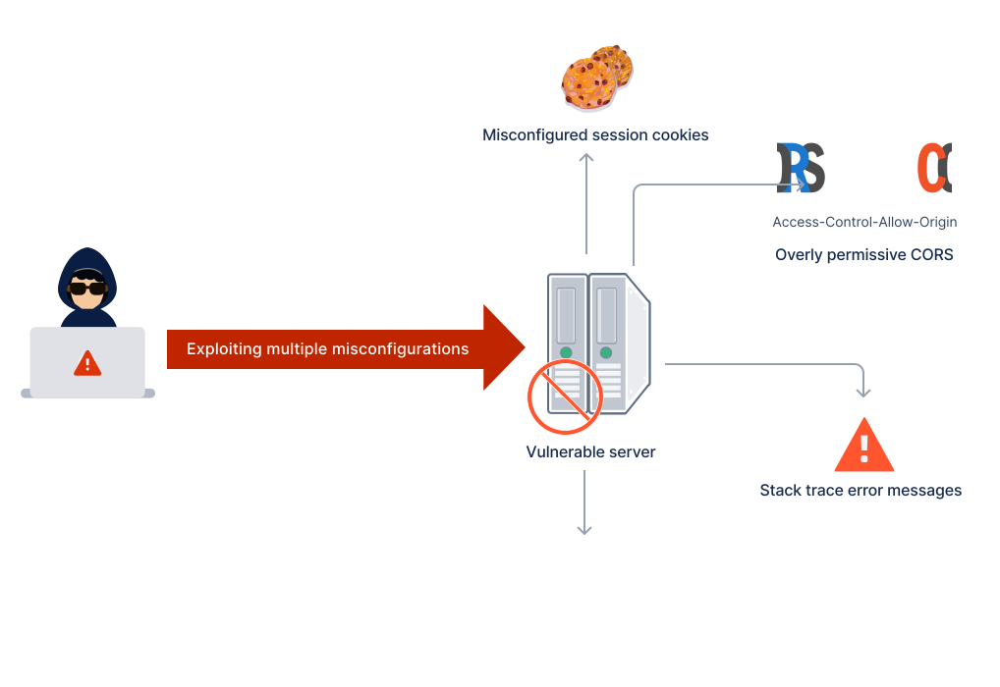

# API A7 - Security Misconfiguration

## What is it?
- Overly permissive access control settings in well know server frameworks.
- The latest security patches are missing, or the systems are out of date.
- Unnecessary features are enabled (e.g., HTTP methods).
- Transport Layer Security (TLS) is missing.
- Security directives are not sent to clients (e.g. common security headers).
- A Cross-Origin Resource Sharing (CORS) policy is missing or improperly set.
- Error messages include stack traces, or other sensitive information is exposed.

## References
[OWASP API TOP-10 A7](https://owasp.org/www-project-api-security/)  

## Test case FAQs

### When is this test case applicable?
* Applicable to all API endpoints.

### How does it work?
The test case does active probing for common API misconfigurations similar to a how a code linter checks for common flaws.

### What is the solution?
- Ensure all APIs are only accessible via TLS.
- Disable API operations (HTTP methods) that are not required to satisfy business functionality.
- Configure CORS headers in a secure manner.
- Make appropriate use of all recommended security headers.
- Do not expose stack traces in error messages. Customize error messages to prevent information leaking via the use of default error messages.
- Do not use default settings and admin credentials for popular server frameworks.
- Regularly patch/update all software components.
- Adopt a tool that provides continuous security validation on your APIs.

