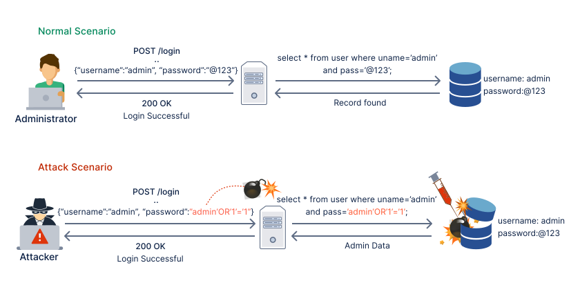

# API A8 - Injection

## What is it?
Attackers construct API calls that include SQL, NoSQL, OS, or other commands, that the API or the backend behind it blindly executes. Essentially this vulnerability arises from passing unsanitized user input directly to database queries or OS command interpreters.

## What are the common types of injection for APIs?
- [SQL Injection][SQLi]
- [NoSQL Injection][NoSQLi]
- [OS Command Injection][CMDi]

## References
- [OWASP API TOP-10 A8](https://owasp.org/www-project-api-security/)
- [Command Injection - CWE 77](https://cwe.mitre.org/data/definitions/77.html)
- [SQL Injection - CWE 89](https://cwe.mitre.org/data/definitions/89.html)
- [NoSQL Injection - CAPEC 676](https://capec.mitre.org/data/definitions/676.html)

## Test case FAQs

### When is this test case applicable?
Applies to all API endpoints that consume user supplied input

## How does it work?
The input parameter(s) within the API endpoint, are injected with malicious data (injection strings). The malicious data tries to trick the API's backend query interpreter, to execute unauthorized commands, which cause leakage of sensitive data, or even a complete denial of service.

## What is the solution?
- Strictly define all API input data, such as schemas, types, and string patterns, and enforce them at runtime.
- Validate, filter, and sanitize all incoming data.
- Define, limit, and enforce API outputs to prevent data leaks.

[SQLi]: https://docs.microsoft.com/en-us/sql/relational-databases/security/sql-injection?view=sql-server-ver15
[NoSQLi]: https://nullsweep.com/a-nosql-injection-primer-with-mongo/
[CMDi]: https://owasp.org/www-community/attacks/Command_Injection