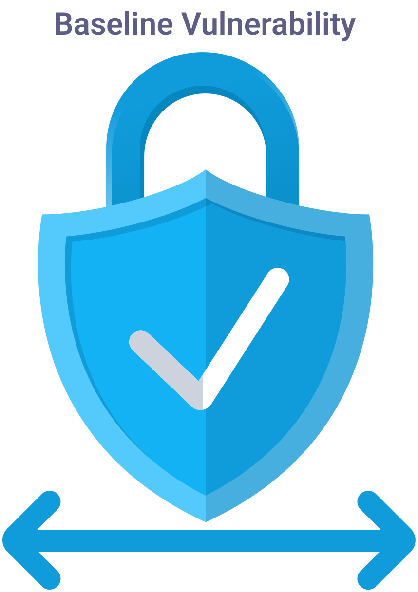

# Cookie without SameSite Attribute

## What is it?
The API endpoint or server is setting a cookie without the 'SameSite' attribute, which means that the cookie can be sent as a result of a ‘cross-site’ request.

The SameSite attribute is an effective counter measure to cross-site request forgery, cross-site script inclusion, and timing attacks.

## References
- [CWE-1275](https://cwe.mitre.org/data/definitions/1275.html)
- [Testing for Cookies](https://owasp.org/www-project-web-security-testing-guide/v42/4-Web_Application_Security_Testing/06-Session_Management_Testing/02-Testing_for_Cookies_Attributes)
- [OWASP API TOP-10 A7](https://owasp.org/www-project-api-security/)  

## Test case FAQs
### When is this test case applicable?
This is applicable for all API endpoints when the **Baseline** security category is enabled in test plans.

### How does it work?
Responses sent by the API server are analyzed for the 'Set-Cookie' header without the 'SameSite' attribute.

### What is the solution?
Ensure that the SameSite attribute is set to either 'lax' or ideally 'strict' for all cookies.

